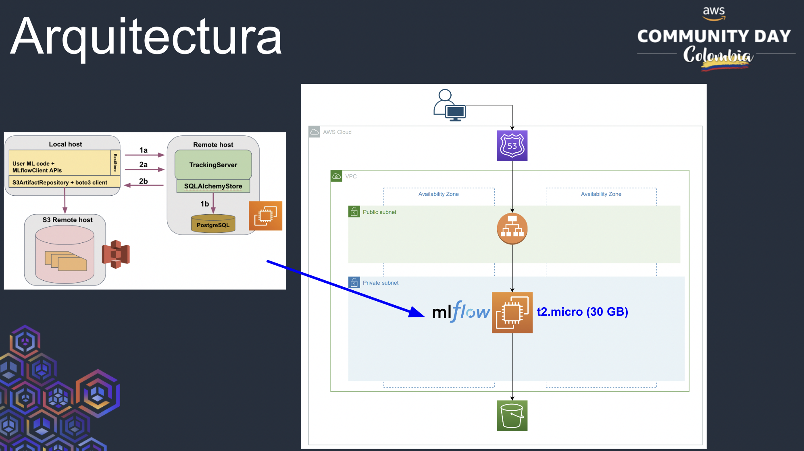

# IaaC project for Implementing MLflow in your ML experiments at low cost from EC2 (AWS Community Day Conference Demo) 🛠️

Welcome to the Project Name! This Terraform script creates AWS resources for managing a development environment.

## Introduction 🚀

This Terraform script provisions an AWS infrastructure with specific resources:

1. **VPC**: Creates a Virtual Private Cloud (VPC) with DNS support and specified CIDR block.
2. **Subnet**: Establishes a public subnet within the VPC, allowing public IP assignment.
3. **Internet Gateway**: Connects the VPC to the internet for public access.
4. **Route Table & Association**: Defines a custom route table and associates it with the public subnet.
5. **Security Group**: Sets up a security group allowing SSH access from a specific IP and unrestricted outbound traffic.
6. **EC2 Instance**: Deploys an EC2 instance in the public subnet, utilizing specified AMI, security group, and key pair.

## Architecture for Terraform Project



## Installation 🚀

### Prerequisites

- Install Terraform ([Installation guide](https://learn.hashicorp.com/tutorials/terraform/install-cli))

- **Clone the repository:**
   ```bash
   git clone <repository_url>
   cd <repository_directory>
   ```

## Usage ℹ️

### Steps

1. Clone this repository.

2. Navigate to the project directory containing `main.tf`.

3. Initialize Terraform:
   ```bash
   terraform init
   ```

4. Review the `variables.tf` file and update values if required.

5. Apply the Terraform configuration:
   ```bash
   terraform apply
   ```

6. Confirm the changes by typing `yes` when prompted.

## Usage

### Customization

- Modify `main.tf` as needed to adjust resource configurations.
- Explore and update the `userdata.tpl` for custom instance initialization scripts.
- Review and adapt security configurations in the `aws_security_group` section.

### Accessing the Deployed Resources

- Access the deployed EC2 instance via SSH using the specified key pair and SSH configuration template.

   Example SSH Command:
   ```bash
   ssh -i /path/to/private_key.pem ubuntu@<INSTANCE_PUBLIC_IP>
   ```

- Use the instance for your development purposes or experimentation within the configured environment.

## Terraform Commands Cheat Sheet 🔑📋

### Initialization 🔧
```bash
# To initiate Terraform project
terraform init
```

### Planning and Applying Changes 📝
```bash
# Check plan
terraform plan

# Create resources and prompt for approval
terraform apply

# Create resources without asking for approval
terraform apply --auto-approve

# Apply changes to a specific target
terraform apply -target <whole_resource_id>

# Apply changes to replace a specific target
terraform apply --replace <whole_resource_object>

# Apply changes with refresh only
terraform apply -refresh-only
```

### Destruction ☠️
```bash
# Destroy resources
terraform destroy
```

### State Management and Output 📄
```bash
# List Terraform managed resources
terraform state list

# Show specific content of a resource
terraform state show <example: aws_eip.one>

# Show Terraform outputs
terraform output
```

### Formatting and Debugging 🛠️🔍
```bash
# Organize formatting of .tf files
terraform fmt

# Refresh Terraform state
terraform refresh

# Use Terraform console
terraform console

# Use Terraform console with specific variables file
terraform console -var-file="dev.tfvars"
```

### Extracting Information with Bash Commands 💻
```bash
# Extract specific information from Terraform state
terraform state show aws_instance.mlflow-demo-tf | grep "public_ip"
```


