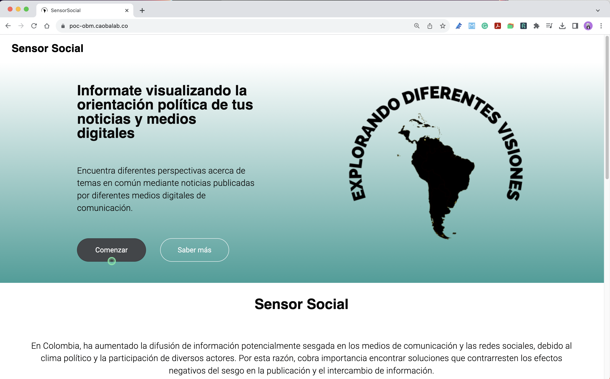
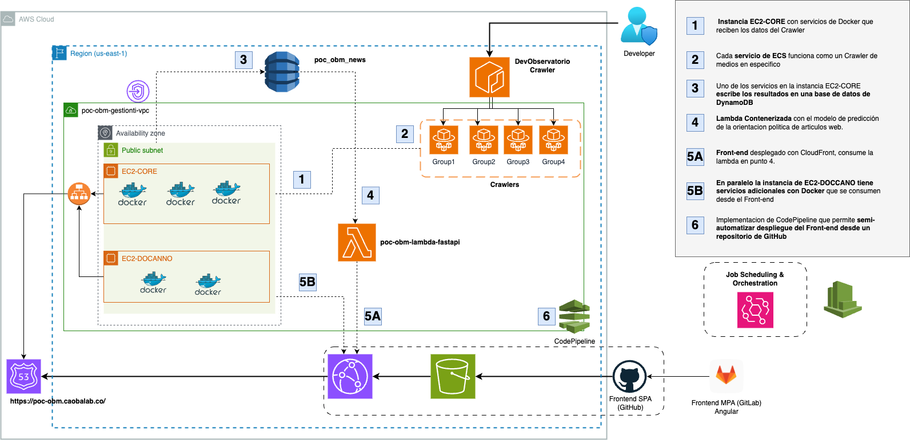

## 🌐 Social Sensor Project

## What can you achieve with the Social Sensor?

📰 Present news from various national media outlets.

📊 Evaluate the political bias present in your media sources.

🔍 Read news while knowing their classification within a political spectrum.

❓ Question your perception of political bias in your digital sources of information.

🔗 **[Explore the Social Sensor in Spanish Here](https://poc-obm.caobalab.co/)**

## Involved as Cloud Engineer for the Cloud Architecture of Social Sensor Project (Explanation in Spanish)

