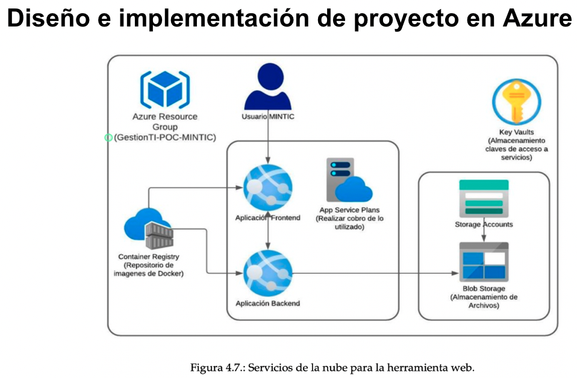
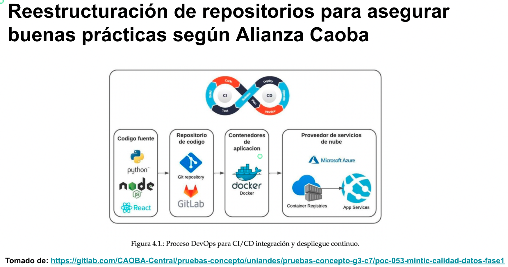

## 🌐 Seal of Excellence for Open Data Quality Project

## What was my role in this project:

🔍 Design and implement a cloud architecture in the Azure cloud to collect, store, and process data for the evaluation of quality criteria established by the National Guide for Quality and Interoperability of Open Data for datasets published on the datos.gov.co platform within the framework of the proof of concept called **poc-053-mintic-calidad-datos-fase1**

## Involved as DevOps/CloudOps for the Seal of Excellence for Open Data Quality Project (Spanish)

## Involved in adjusting the DevOps process (Spanish)

## Involved in refactoring the multi-container app to be deployed as Azure Application (Spanish)

